# Business AI Portföy Uzmanı — Crawlee mimarisi ve işletim rehberi

Bu belge Portföy Uzmanı'nın teknik işletim rehberidir. Hukuk görüşü değildir. Canlı
bir kaynaktan veri almadan veya bir kişiye ileti göndermeden önce sözleşme,
KVKK, İYS ve sektörel yükümlülükler yetkili hukuk uzmanıyla doğrulanmalıdır.

## Sistem akışı

```mermaid
flowchart LR
    UI["Portföy Uzmanı: il, ilçe ve ilan filtreleri"]
    API["Next.js HuntJob API"]
    AUTH["SourceAuthorization"]
    QUEUE["HuntJob kuyruğu"]
    WORKER["Ayrı Crawlee worker"]
    LIST["LIST: görünür sonuç satırları"]
    DETAIL["DETAIL: açıklama, konum ve özellikler"]
    MEDIA["MEDIA: referans veya izinli kopya"]
    DB["İlan veritabanı"]
    CP["ContactProvider"]
    POLICY["ContactPolicy"]
    HUMAN["İnsan onayı"]
    OUTBOX["WhatsApp taslağı / outbox"]

    UI --> API
    API --> AUTH
    AUTH --> QUEUE
    QUEUE --> WORKER
    WORKER --> LIST
    LIST --> DETAIL
    DETAIL --> MEDIA
    MEDIA --> DB
    DB --> CP
    CP --> POLICY
    POLICY --> HUMAN
    HUMAN --> OUTBOX
```



Tarama katmanı yalnız yazılı kaynak yetkisinde `CONTACT_READ` kapsamı varsa
detay sayfasında kullanıcıya görünür satıcı adı ve telefonu alır. Telefon AES
ile şifrelenir, HMAC ile tekilleştirilir ve loglanmaz. İlanın tam olması,
kişiye ileti gönderilebileceği anlamına gelmez; mesajlaşma izni ayrı politika
katmanında fail-closed değerlendirilir.

## Bileşenler

- `POST /api/fabrika/hunting/jobs`: tenant oturumundan iş oluşturur.
- `GET /api/fabrika/hunting/jobs/:id/export`: yalnız aynı tenant içindeki işi,
  ilan detayları ve görselleriyle indirilebilir JSON olarak verir.
- `workers/avci-crawler/index.ts`: Next.js request sürecinden bağımsız,
  sürekli çalışan worker girişidir.
- `src/lib/hunting-v2/worker.ts`: LIST, DETAIL ve MEDIA akışını yürütür.
- `src/lib/hunting-v2/parsers.ts`: kayıtlı HTML fixture'larını veya izinli
  kaynaktan gelen HTML'i yapılandırılmış veriye çevirir.
- `src/lib/hunting-v2/contact-providers.ts`: telefonun yalnız doğrulanmış
  sağlayıcıdan gelmesini sağlar.
- `src/lib/hunting-v2/contact-policy.ts`: her iletişim girişimini fail-closed
  değerlendirir.
- `src/lib/company-whatsapp.ts`: kuyruğa alma ve gerçek dispatch öncesinde
  politikayı tekrar çalıştırır.
- Eski tarayıcı eklentisi entegrasyonu geriye dönük uyumluluk için kalabilir;
  standart kullanımda eklenti veya bağlantı kopyalama gerekmez. Kullanıcı il,
  ilçe, satış/kiralama, konut tipi, eşya durumu ve fiyat aralığını seçer. URL
  sunucuda oluşturulur ve `Kimden: Sahibinden` yolu değiştirilemez.
- Eşya durumu kaynakta kullanılan `a103713=true|false`, fiyat aralığı
  `price_min|price_max` ve en yeni sıralaması `sorting=date_desc` parametreleriyle
  taşınır. Serbest hostname veya kullanıcı URL'si standart panelden alınmaz.

## Yerel kurulum

1. `.env.example` dosyasını temel alarak yerel secret store veya `.env.local`
   içinde gerekli değişkenleri tanımlayın. Secret'ları Git'e eklemeyin.
2. Prisma istemcisini ve migration'ı hazırlayın:

   ```bash
   npx prisma generate
   npx prisma migrate deploy
   ```

3. Next.js uygulamasını başlatın:

   ```bash
   npm run dev
   ```

4. Ayrı bir terminal veya ayrı servis içinde worker'ı başlatın:

   ```bash
   npm run worker:avci
   ```

Worker, `QUEUED` durumundaki en eski işi atomik olarak sahiplenir. Worker
Vercel serverless request'i içinde çalıştırılmamalıdır; production'da ayrı,
uzun süre çalışan Node.js servisi gerekir.

## Güvenli fixture testi

Canlı siteye istek atmayan fixture'lar şurada tutulur:
`src/lib/hunting-v2/__fixtures__/`.

```bash
npx vitest run src/lib/hunting-v2
```

`FIXTURE` provider production dışında sentetik yetki kaydını otomatik
hazırlayabilir. Fixture kayıtları gerçek ilan veya telefon değildir ve canlı
iletişim için kullanılamaz.

## Job durumları

| Durum | Anlamı |
| --- | --- |
| `QUEUED` | Worker tarafından alınmayı bekliyor. |
| `RUNNING` | LIST/DETAIL/MEDIA işleniyor. |
| `PAUSED` | Operatör müdahalesi için durdu. |
| `COMPLETED` | Keşfedilen kayıtların tamamı işlendi. |
| `PARTIAL` | En az bir detay veya medya tamamlanamadı. |
| `FAILED` | İş güvenli biçimde başarısız oldu. |
| `CANCELLED` | Kullanıcı işi durdurdu; worker ara kontrolünde bırakır. |
| `SOURCE_CHALLENGE` | Kaynak challenge gösterdi; aşma denenmedi. |

Panel her başlatmada yeni bir idempotency anahtarı üretir; böylece aynı filtre
daha sonra yeniden taranabilir. İlanlar
`companyAccountId + provider + sourceListingId` ile tekilleştirilir. Resume,
yalnız durdurulabilir durumları yeniden `QUEUED` yapar.

## Tarama temposu ve doğal bitiş

- Kullanıcı arayüzünde sayfa, bekleme veya eşzamanlılık ayarı yoktur.
- Worker tek istek eşzamanlılığıyla çalışır ve aynı alan adına varsayılan olarak
  20 saniye ara verir.
- `AVCI_CRAWLER_DELAY_SECS` 10–300 saniye,
  `AVCI_CRAWLER_MAX_REQUESTS_PER_MINUTE` 1–6 aralığında sunucudan
  yapılandırılabilir.
- Sabit bir sayfa sınırı uygulanmaz. Sonraki sayfa bağlantısı kalmadığında kuyruk
  doğal olarak tamamlanır; yinelenen URL ve ilanlar benzersiz anahtarla elenir.
- Worker kendini `Business-AI-Portfoy-Uzmani/2.0` adıyla bildirir; oturum
  döndürme, gizlenme veya challenge aşma kullanmaz.

## JSON çıktısı

İlan gezginindeki `JSON indir` düğmesi seçili av işinin başlık, fiyat,
açıklama, konum, dinamik özellik, görsel, görünür satıcı adı ve yetkili telefon
alanlarını tek dosyada dışa aktarır. Endpoint iş kimliğini oturumdaki
`companyAccountId` ile birlikte doğrular ve `private, no-store` döner.
Telefon yalnız işin kaynak yetkisi o anda aktifse, tarih aralığı geçerliyse ve
`CONTACT_READ` kapsamı varsa çözülür. Bu koşullardan biri yoksa ham telefon
yerine yalnız maskeli özet döner; ciphertext hiçbir zaman JSON'a eklenmez.

## SourceAuthorization oluşturma süreci

Canlı provider iki ayrı kilit açılmadan çalışmaz:

1. Ortamda `AVCI_LIVE_PROVIDER_ENABLED=true` olmalıdır.
2. İlgili tenant ve provider için süresi geçmemiş `ACTIVE`
   `SourceAuthorization` bulunmalıdır.

Yetki yalnız platform yöneticisi oturumundan
`/api/platform-admin/hunting/source-authorizations` endpoint'iyle
oluşturulabilir. Müşteri hesabı kendi kendine yetki veremez.

Örnek istek gövdesi:

```json
{
  "companyAccountId": "tenant_kaydi",
  "provider": "SAHIBINDEN",
  "status": "ACTIVE",
  "allowedScopes": ["SEARCH_READ", "DETAIL_READ", "MEDIA_READ", "CONTACT_READ"],
  "contractReference": "imzali-sozlesme-referansi",
  "startsAt": "2026-07-29T00:00:00.000Z",
  "expiresAt": "2027-07-29T00:00:00.000Z"
}
```

Aktif yetkide `SEARCH_READ`, `DETAIL_READ`, `MEDIA_READ` ve `CONTACT_READ`
zorunludur.
`MEDIA_COPY`, görsel kopyalama hakkı sözleşmede açıkça varsa ve object storage
hazırsa eklenir. `CONTACT_READ` yalnız kaynak sözleşmesinde görünür iletişim
alanlarını alma yetkisi açıkça varsa eklenir; challenge, giriş kontrolü veya
gizli bir uç noktanın aşılmasına izin vermez.

Yetkiyi askıya alma veya iptal etme:

```json
{
  "id": "source_authorization_id",
  "status": "SUSPENDED"
}
```

`PATCH /api/platform-admin/hunting/source-authorizations` anında yeni iş
başlatmayı ve worker'ın sonraki yetki kontrolünü engeller. Sözleşme ve kapsam
belgesi uygulama secret'ı değildir; fakat gerçek belge içeriği bu tabloda değil,
kurumun kontrollü belge sisteminde tutulmalıdır.

## Canlı provider neden varsayılan kapalıdır?

- Kaynak kullanım şartları ve API/veri aktarım koşulları değişebilir.
- Yazılı yetki olmadan otomatik erişim hem sözleşmesel hem operasyonel risk
  doğurabilir.
- HTML yapısı değişebilir veya challenge gösterilebilir.
- Avcı challenge, CAPTCHA, oturum veya erişim kontrolünü aşmayı denemez.

Canlı açılış öncesinde parser fixture'ı, sözleşme kapsamı, istek limiti,
robots.txt davranışı ve kaynak sahibinin teknik erişim yöntemi birlikte
doğrulanmalıdır.

## LIST, DETAIL ve MEDIA

### LIST

- Filtreli sonuç sayfasındaki görünür ilanları okur.
- İlan numarasıyla tekilleştirir.
- Sonraki liste sayfası kalmayana kadar DETAIL isteklerini sırayla kuyruğa
  ekler.
- Telefon veya gizli alan aramaz.

### DETAIL

- Başlık, fiyat, para birimi, tarih, kategori, alt kategori ve satıcı tipini
  çıkarır.
- `CONTACT_READ` kapsamında, yalnız sayfada görünür satıcı bloğundaki adı ve
  `tel:`/görünür telefon metnini alır; script veya özel uç nokta taramaz.
- Telefonu veritabanına yazmadan önce AES-GCM ile şifreler ve HMAC ile
  tenant içinde tekilleştirir; loglara veya hata özetine koymaz.
- Açıklamanın düz metnini ve sanitize edilmiş HTML'ini saklar.
- Dinamik özellikleri `attributesJson` içinde, sık kullanılan alanları
  ilişkisel kolonlarda saklar.
- İl, ilçe, mahalle, yayınlanmışsa sokak ve koordinatı kaydeder.
- Eksik adresi tahmin etmez; `addressPrecision` gerçek ayrıntı seviyesidir.

### MEDIA

- `MEDIA_COPY` yoksa kaynak URL ve metadata saklanır.
- `MEDIA_COPY` varsa MIME, boyut, DNS/private IP ve redirect hedefi yeniden
  doğrulanır; içerik SHA-256 checksum ile object storage'a kopyalanır.
- Varsayılan üst sınır `AVCI_MEDIA_MAX_BYTES` ile yönetilir.
- JPEG, PNG ve WebP dışındaki türler reddedilir.

## ContactProvider ekleme

Her provider `ContactProvider` arayüzünü uygulamalı ve yapılandırılmamışsa
`PROVIDER_DISABLED` ile fail-closed davranmalıdır.

1. `contactProviderImportSchema` ile payload'ı doğrulayın.
2. Tenant içindeki `listingId` eşleşmesini zorunlu kılın.
3. Kaynak referansı, amaç, rol, doğrulama kanıtı ve saklama sonunu alın.
4. Telefonu loglamayın; `phoneCiphertext` ile şifreleyin ve secret-key HMAC ile
   tekilleştirin.
5. UI'ye yalnız `maskedPhone` döndürün.
6. Provider credential'ını yalnız environment secret store'da tutun.
7. Provider fixture, invalid evidence, tenant izolasyonu ve disabled durumunu
   test edin.

Hazır adapter'lar:

- `PartnerFeedContactProvider`
- `BanaEmlakciBulContactProvider`
- `FirstPartyOptInContactProvider`
- `ExistingCrmContactProvider`
- `ManualVerifiedContactProvider`

Credential tanımlı olmayan canlı adapter çalışmaz.

## Telefon, izin, ret ve insan onayı

Bir kayıt yalnız aşağıdaki koşulların tamamı sağlanırsa `CONTACT_READY` olur:

1. Telefon `OTP_VERIFIED`, `PARTNER_VERIFIED` veya `MANUALLY_VERIFIED` olmalı.
2. Kişi `OWNER` veya `AUTHORIZED_REPRESENTATIVE` olmalı.
3. Kaynak, `SALES_AUTHORITY_DISCUSSION` amacına açıkça izin vermeli.
4. KVKK işleme dayanağı `CONFIRMED` olmalı.
5. İlgili kanal izni `GRANTED` olmalı.
6. Gerekiyorsa İYS durumu `APPROVED` olmalı.
7. Suppression/ret/şikâyet kaydı olmamalı.
8. Saklama süresi dolmamış olmalı.
9. Kayıt aynı tenant'a ait olmalı.
10. Yetkili insanın, ilan + kişi + kanal + amaç kapsamlı onayı bulunmalı.

Herhangi bir alan `UNKNOWN` ise iletişim engellenir. Her değerlendirme
`ContactPolicyDecision` append-only denetim kaydına yazılır. AI yalnız taslak
hazırlar; telefon veya gereksiz kişisel veri LLM'e gönderilmez. Dispatch
anında ret ve izin durumu tekrar kontrol edilir.

`LEGACY_UNVERIFIED` kayıtları karantinadadır, ciphertext taşımadan maskeli
tutulur ve hiçbir koşulda iletişim için kullanılamaz.

## KVKK ve İYS kontrol noktaları

- Kişisel verinin hangi kaynaktan, hangi amaçla ve hangi hukuki sebeple
  alındığını belgeleyin.
- KVKK işleme dayanağı ile ticari elektronik ileti iznini ayrı kaydedin.
- Kanal, amaç, alıcı türü, metin sürümü ve kanıt referansını saklayın.
- Ret veya geri alma olayını gecikmeden suppression kaydına dönüştürün.
- İYS gerekliliğini alıcı türü ve güncel mevzuata göre hukuk uzmanıyla
  belirleyin.
- Telefonun bir ilanda görünmesini iletişim izni saymayın.

Resmî referanslar:

- [sahibinden.com Kullanım Koşulları](https://www.sahibinden.com/sozlesmeler/ek-1-kullanim-kosullari-37)
- [sahibinden.com API Kullanımı ile Veri Transferi](https://yardim.sahibinden.com/hc/tr/articles/19780244786460-API-Kullan%C4%B1m%C4%B1-ile-Veri-Transferi)
- [Bana Emlakçı Bul](https://yardim.sahibinden.com/hc/tr/articles/25228696823580-Bana-Emlak%C3%A7%C4%B1-Bul-Nedir)
- [KVKK üçüncü kişilerden elde edilen veriler duyurusu](https://www.kvkk.gov.tr/Icerik/8830/ucuncu-kisilerden-elde-edilen-kisisel-verilerin-reklam-ve-pazarlama-amacli-kullanilmasina-iliskin-kamuoyu-duyurusu)
- [Ticaret Bakanlığı ticari elektronik iletiler](https://www.ticaret.gov.tr/ic-ticaret/ticari-elektronik-iletiler/genel-bilgiler)

## Saklama ve silme

- `retentionUntil` dolduğunda politika iletişimi hemen engeller.
- Planlı bakım işi, süresi dolan telefon ciphertext'ini silmeli; denetim için
  gerekli minimum maskeli/HMAC/suppression verisini kurum politikasına göre
  saklamalıdır.
- Kaynak ilan kaldırıldığında `removedAt` ve `REMOVED` durumu kullanılmalı;
  denetim gerektirmeyen medya kopyaları saklama planına göre temizlenmelidir.
- Açık silme talebi, hukuki saklama zorunluluğu ve denetim izi birlikte
  değerlendirilmelidir.
- Loglara telefon, ciphertext, consent kanıt içeriği veya credential yazmayın.

Otomatik temizlik worker'ı bu sürümde yoktur; production açılışından önce
saklama politikasına uygun zamanlanmış iş eklenmelidir.

## Failure, retry ve challenge

- Her request sınırlı timeout kullanır; toplam iş, sonraki sayfa kalmadığında
  doğal biçimde biter.
- Otomatik request retry kapalıdır; tekrar deneme operatörün job resume
  işlemiyle görünür ve kontrollüdür.
- Kısmi detaylar `PARTIAL`, erişilemeyen kayıtlar uygun acquisition durumuyla
  tutulur.
- Challenge algılanırsa `SOURCE_CHALLENGE` kaydedilir, hassas veri içermeyen
  özet oluşturulur ve aşma denenmez.
- Resume öncesinde kaynak erişimi, sözleşme ve challenge sebebi insan
  tarafından kontrol edilmelidir.

## Production gereksinimleri

- Migration uygulanmış PostgreSQL.
- Next.js uygulamasından ayrı, sürekli çalışan worker servisi.
- Worker ve web için aynı production veritabanı bağlantısı.
- Secret manager içinde şifreleme/HMAC ve provider credential'ları.
- `MEDIA_COPY` kullanılacaksa object storage token'ı.
- Worker outbound allowlist, kaynak başına düşük concurrency ve gözlemleme.
- `SOURCE_CHALLENGE`, `FAILED`, uzun süren `RUNNING` ve kuyruk birikimi için
  alarm.
- Uygulama seviyesindeki bellek rate limit'i yerine çok instance'lı
  production'da Redis/KV tabanlı ortak rate limit.
- Saklama süresi dolan veriler için zamanlanmış temizlik işi.
- Canlı smoke testte gerçek telefon veya mesaj kullanmayan izinli test hesabı.

### Railway worker servisi

Repo kökündeki `railway.worker.toml` ve `Dockerfile.avci-worker`, yalnız uzun
süre çalışan worker servisini tanımlar. Vercel web uygulaması ayrı kalır;
Railway ve Vercel aynı production PostgreSQL bağlantısını ve aynı şifreleme/HMAC
secret'larını kullanır. Railway servisinde start komutunu değiştirmek gerekmez.
İşlem kapanırken `SIGTERM`/`SIGINT` yakalanır; bir instance düşüp işi `RUNNING`
bırakırsa `AVCI_WORKER_STALE_MS` sonrasında başka worker işi idempotent biçimde
yeniden sahiplenebilir. İlk canlı açılışta tek replica kullanılmalıdır.

### Apify isteğe bağlı worker

Ücretsiz deneme ve düşük hacimli kullanım için `.actor/actor.json`, aynı
`Dockerfile.avci-worker` konteynerini `AVCI_RUN_ONCE=true` ile çalıştırır.
Vercel, yalnız `QUEUED` durumunda bir iş oluştuğunda Apify Run Actor API'sini
Bearer token ile çağırır. Actor kuyruktan en eski işi atomik biçimde sahiplenir,
tek işi tamamlar ve kapanır; boş kuyrukta bekleyerek kredi tüketmez.

Vercel tarafında `AVCI_WORKER_DISPATCH_MODE=apify`,
`APIFY_AVCI_ACTOR_ID` ve secret store içinde `APIFY_TOKEN` gerekir. Apify
tarafında web uygulamasıyla aynı `DATABASE_URL`,
`WHATSAPP_CREDENTIAL_ENCRYPTION_KEY` ve `HUNTING_CONTACT_HMAC_KEY` kullanılır.
Bir Actor çalıştırmasının üst maliyet sınırı tetikleyici tarafından belirlenir;
sağlayıcı hata gövdesi ve token uygulama hata mesajlarına taşınmaz.

## Ortam değişkenleri

`.env.example` değişken isimlerinin güncel listesidir. Özellikle:

- `AVCI_LIVE_PROVIDER_ENABLED`
- `AVCI_CRAWLER_CONCURRENCY`
- `AVCI_CRAWLER_MAX_REQUESTS`
- `AVCI_WORKER_POLL_MS`
- `AVCI_WORKER_STALE_MS`
- `AVCI_WORKER_DISPATCH_MODE`
- `AVCI_RUN_ONCE`
- `APIFY_AVCI_ACTOR_ID`
- `APIFY_TOKEN`
- `AVCI_CONTACT_RETENTION_DAYS`
- `AVCI_MEDIA_MAX_BYTES`
- `HUNTING_EXTENSION_ALLOWED_ORIGINS`
- `WHATSAPP_CREDENTIAL_ENCRYPTION_KEY`
- `HUNTING_CONTACT_HMAC_KEY`
- ContactProvider credential değişkenleri
- `BLOB_READ_WRITE_TOKEN`

Gerçek değerler hiçbir zaman repo, hata mesajı veya istemci bundle'ına
yazılmamalıdır.
